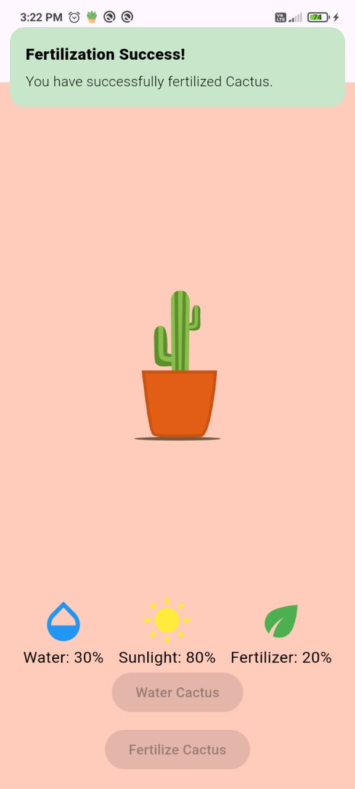

# AR-Themed Virtual Plant Care App (Mystical Plant Realm)

Welcome to the **AR-Themed Virtual Plant Care App (Mystical Plant Realm)**! This application allows users to grow and nurture multiple virtual plants on their phone simultaneously. The plants grow progressively based on user actions like watering, sunlight exposure, and fertilization, while animations and user interactions create an immersive plant care experience.

## Table of Contents

1. [Features](#features)
    - [Plant Growth Simulation](#plant-growth-simulation)
    - [Care Indicators](#care-indicators)
    - [Push Notifications](#push-notifications)
    - [Customizable Plants](#customizable-plants)
    - [Dynamic Day/Night Cycle](#dynamic-daynight-cycle)
    - [Confetti Animation](#confetti-animation)
    - [Plant Care Details](#plant-care-details)
2. [App Screens](#app-screens)
    - [Home Screen](#home-screen)
    - [Plant Customization and Selection](#plant-customization-and-selection)
    - [Care Indicators](#care-indicators)
3. [Setup and Installation](#setup-and-installation)
    - [Prerequisites](#prerequisites)
    - [Firebase Setup](#firebase-setup)
    - [Running the App](#running-the-app)
4. [App Images and Video Demo](#app-images-and-video-demo)
5. [Folder Structure](#folder-structure)
6. [State Management](#state-management)
7. [Animations](#animations)
8. [Firebase Integration](#firebase-integration)
9. [Conclusion](#conclusion)

---

## Features

### 1. Plant Growth Simulation

- The virtual plant grows progressively over time based on user actions such as:
    - **Watering**: Users can water the plant once every X hours, contributing to its growth.
    - **Sunlight**: The plant receives sunlight if the app is open during daytime hours (based on the user's system time).
    - **Fertilization**: Users can fertilize the plant to speed up growth (limited to once per day).
    - **Lottie Animations**: Smooth animations show the different stages of plant growth, enhancing the user experience.

### 2. Care Indicators

- **Water Level**: A droplet icon shows the water level, which depletes over time and replenishes upon watering.
- **Sunlight**: A sun icon dims when the plant isn’t receiving enough light.
- **Fertilizer**: An indicator shows when the plant needs fertilizing.
- These real-time indicators are managed using **GetX** for state management.

### 3. Push Notifications

- Notifications remind users to care for their plants:
    - **Watering Reminder**: Notifies when the plant needs water.
    - **Fertilizing Reminder**: Notifies when the plant requires fertilizing.
    - **Critical State Notifications**: Alerts users when the plant's water or sunlight needs become urgent.
- **Firebase Messaging** is used to handle these notifications.

### 4. Customizable Plants

- Users can choose from a variety of plant types, each with unique growth characteristics:
    - **Sahara Cactus**: Requires less water.
    - **Flower Cactus**: Moderate water requirements.
    - **Lily Flower**: Requires more sunlight.
    - **Rose Flower**: Balanced water and sunlight needs.
    - **Maize Plant**, **Tomato Plant**, **Mango Tree**, etc.: Each has its own care needs.
- The plant customization happens during the plant selection process, allowing users to grow any number of plants at the same time.

### 5. Dynamic Day/Night Cycle

- The app theme changes based on the user's system time:
    - **Morning**: Light theme with morning shades.
    - **Afternoon**: Bright theme representing the midday sun.
    - **Evening**: Soft transition towards evening with warm shades.
    - **Night**: Dark theme, where the plant "rests" and grows slower.
- The plant's growth speed and behavior adjust according to the time of day.

### 6. Confetti Animation

- After watering or fertilizing the plant, a **confetti animation** appears, giving users instant visual feedback for their care actions.

### 7. Plant Care Details

- On the **plant selection screen**, long-pressing any plant card displays the specific **plant care details** such as water needs, sunlight requirements, and fertilization frequency.

---

## App Screens

### 1. Home Screen

- Displays the virtual plant and its growth state.
- Real-time care indicators for water, sunlight, and fertilizer.
- Buttons for watering and fertilizing the plant.
- The theme adapts to the time of day, with morning, afternoon, evening, and night shades.

### 2. Plant Customization and Selection

- Users can choose from a variety of plants, including Sahara Cactus, Flower Cactus, Lily Flower, Rose Flower, Maize Plant, Tomato Plant, and Mango Tree.
- Long-press on any plant card to view the care requirements for that plant.

### 3. Care Indicators

- Visual indicators that update in real-time, showing the plant’s water, sunlight, and fertilizer needs.
- Confetti animations for positive feedback after care actions.

---

## Setup and Installation

### Prerequisites

1. **Flutter SDK**: Ensure Flutter is installed. If not, follow the [installation guide](https://flutter.dev/docs/get-started/install).
2. **Firebase** account and project.

### Firebase Setup

#### Android Setup:

1. Go to the [Firebase Console](https://console.firebase.google.com/), create a new project, and add an Android app.
2. Download the `google-services.json` file and place it in the `android/app/` directory.
3. Modify the `android/build.gradle` and `android/app/build.gradle` files to include the Google services plugin:
    - **Project-level `build.gradle`**:
      ```gradle
      buildscript {
          dependencies {
              classpath 'com.google.gms:google-services:latest_version'
          }
      }
      ```
    - **App-level `build.gradle`**:
      ```gradle
      apply plugin: 'com.google.gms.google-services'
      ```

#### iOS Setup:

1. Add an iOS app in Firebase and download the `GoogleService-Info.plist` file.
2. Place it in the `ios/Runner/` directory and ensure it is included in the app bundle.

### Running the App

1. **Clone the repository**:
   ```bash
   git clone <repository-url>
   cd ar-themed-virtual-plant-care-app
   ```
2. **Install dependencies**:
   ```bash
   flutter pub get
   ```
3. **Run the app**:
   ```bash
   flutter run
   ```

---

## App Images and Video Demo

### Screenshots

Below are some screenshots of the app in action:





Firebase Firestore Database:


### Video Demo

Check out a video demonstration of the app in action:

[](video/app_demo.mp4)

---

## Folder Structure

```
ar-themed-virtual-plant-care-app/
│
├── android/                        # Android-specific files
├── ios/                            # iOS-specific files
├── lib/                            # Main application code
│   ├── controllers/                # GetX controllers for managing state
│   │   └── plant_controller.dart   # Handles plant actions (watering, fertilizing)
│   ├── models/                     # Data models for plant entities
│   │   └── plant_model.dart        # Model defining plant properties
│   ├── screens/                    # Screens for UI interactions
│   │   ├── home_screen.dart        # Displays the virtual plant and indicators
│   │   ├── plant_selection.dart    # Allows users to select their plant
│   ├── services/                   # Firebase and notification services
│   │   └── firebase_service.dart   # Manages Firebase interactions and messaging
│   ├── widgets/                    # UI components like plant widget, care indicators
│   │   ├── plant_widget.dart       # Displays plant growth with animations
│   │   └── care_indicators.dart    # Displays water, sunlight, and fertilizer indicators
│   └── main.dart                   # Entry point of the application
│
├── assets/                         # Static assets (images, animations)
├── pubspec.yaml                    # Flutter dependencies and assets configuration
└── README.md                       # Project documentation
```

---

## State Management

The app uses **GetX** for real-time state management of plant growth, water, sunlight, and fertilizer levels. The reactive variables in **PlantController** ensure that the UI reflects changes in real-time as users interact with the plant.

---

## Animations

1. **Lottie Animations**: Used for the plant’s growth from a sprout to a full-grown plant.
2. **Confetti Animation**: Triggered when watering or fertilizing the plant.
3. **Theme Transition Animations**: Subtle changes between day and night cycles, with different shades representing morning, afternoon, evening, and night.

---

## Firebase Integration

1. **Firebase Firestore**: Used to store the plant's growth state, care

status (water, sunlight, fertilizer levels), and synchronize the data across sessions. 2. **Firebase Messaging**: Sends push notifications to remind users to water or fertilize their plants.

---

## Conclusion

The AR-Themed Virtual Plant Care App offers an immersive plant care experience, allowing users to grow and nurture multiple plants simultaneously. Through the use of Lottie animations, dynamic themes, and real-time notifications, users are engaged in an interactive and rewarding plant-growing simulation.

For further customization, explore the codebase.

---

#### Author: Visagan S

---
